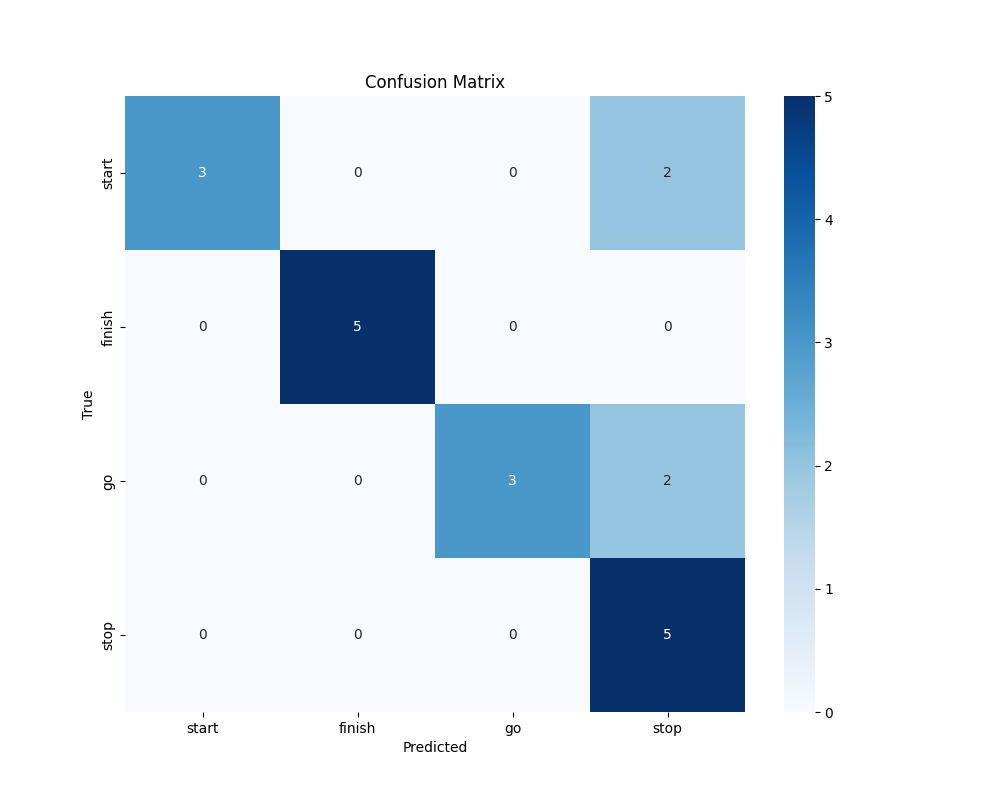

# Voice Command Recognition

Simple voice command with LPC and LSF =)

## File structure
First we must do preemphasis (`preemphasis.py`). Filter, Hamming window and ZCR and Power could be replaced by **librosa** own functions. 

The processed and trimmed signal is safed in _Processed_ as a `.npy`. The *LPC* and *Autocorrelation* coefficients are also safed as `.npy` in _Coeff_.
With shape `[number of frames in audio sample, 2, 12]`. 

_Raw_ contains my original recording: PCM signed 16 integer, mono, 16000 framerate.

    ├── Data 
    │   ├── Coeff
    │   ├── Processed
    │   └── Raw

## Results
Here are is the confusion matrix with a 10 samples per word (start, stop, finish, go) with 5 test words. The codebook created has 16 vectors of lpc coeffiicents of dimension 12
and the testing was done with autocorrelation coefficients with dimension 12. 

